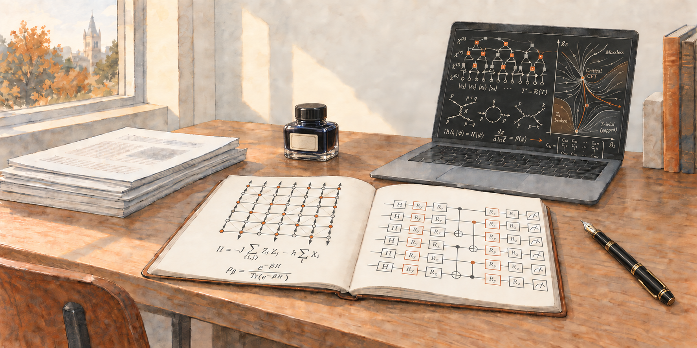

## A Brief Bio

Welcome! My name is Ruihao Li (李瑞浩). I am a quantum algorithms researcher with a background in theoretical physics.
I am working as a Quantum Research Data Scientist at [Cleveland Clinic Research](https://www.lerner.ccf.org/).
My research concerns quantum simulation and optimization, with collaborators across different institutions and disciplines.

I grew up in [Guangdong, China](https://en.wikipedia.org/wiki/Guangdong). I received my B.Sc. Honours (Advanced), with First Class Honours in Physics, from [The University of Sydney](https://www.sydney.edu.au/) in 2016, and my Ph.D. in Physics from [Case Western Reserve University](https://case.edu/) in 2023, advised by [Shulei Zhang](https://physics.case.edu/faculty/shulei-zhang/).
My doctoral research examined the interplay of symmetry and topology in condensed-matter and high-energy physics, specifically topological semimetals and dark matter models.
During my undergraduate studies, I also spent an exchange period at the University of California San Diego studying.

My current work focuses on many-body physics, quantum simulation, and optimization. In particular, I develop methods for preparing Gibbs states and quantum algorithms for protein structure prediction. See my [Research page](/research/) for current projects, publications, and talks.

## Other Interests

- Fan of basketball and LeBron James :crown:
- Avid cook from time to time :shallow_pan_of_food:
- Animal videos all day :cat:
- Mechanical stuff and tech gadgets :gear:
