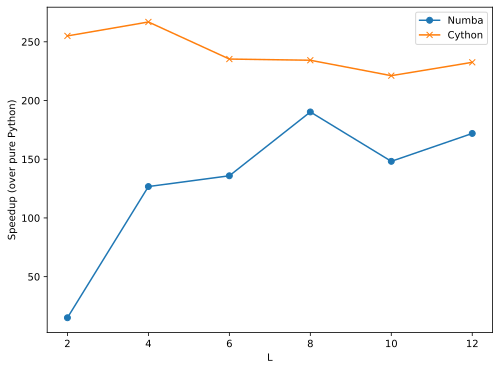

<!-- <style>
r { color: Red }
o { color: Orange }
g { color: Green }
b { color: Blue}
</style> -->



Okay, I'll admit that this is neither a super exciting nor a new topic to write about. But I've been looking into some ways to simulate/prepare thermal states these days and the [Metropolis Monte Carlo algorithm](https://en.wikipedia.org/wiki/Metropolis%E2%80%93Hastings_algorithm) (which is also often referred to as the Metropolis-Hastings algorithm) is probably one of the most well-known methods to do so. Before fully stepping into the quantum realm (see Refs. [[1]](#references) and [[2]](#references) for quantum generalizations of this method), I thought I might as well try my hand at the classical version first. I have decided to use this technique to simulate the ferromagnetic phase transition of the famous 2D [Ising model](https://en.wikipedia.org/wiki/Ising_model) in statistical physics. Instead of focusing on the physics or the algorithm itself, the main discussion of this post will revolve around how to use [Numba](https://numba.pydata.org/) and [Cython](https://cython.org/) to "supercharge" the Pythonic implementation.


## Metropolising the Ising model

<center>

</center>

Let us first say something about our objective here. Given a two-dimensional Ising model on an $L\times L$ square lattice, that is, $L^2$ spins which can only take values $+1$ (spin-up or red) or $-1$ (spin-down or blue) as displayed in the figure above, we want to simulate the thermal state of the system at finite temperature and extract a few thermal expectation values such as energy and magnetization along the way. Based on the evolution of net magnetization with an increasing temperature, we should observe a phase transition from a ferromagnetic (with finite magnetization) to a non-magnetic state (with zero magnetization) at some critical temperature $T_C$. Note that in 1D such phase transition will not happen due to the Peierls argument that dates back to the 1930s (see an explanation [here](https://www.lpthe.jussieu.fr/~leticia/TEACHING/Master2019/intro-phase-transitions.pdf)). In its simplest form, the Ising Hamiltonian of the system is given by
$$
H = -J\sum_{\braket{i,j}}\sigma_i\sigma_j,
$$
where $\braket{i, j}$ denotes all pairs of neighboring spins on the lattice and $J$ is the coupling strength between any two spins.

To compute any thermal expectation, we need to know the probability distribution of different spin configurations, which, in this case, is the Boltzmann distribution since the system is essentially a [canonical ensemble](https://en.wikipedia.org/wiki/Canonical_ensemble) *at equilibrium*:
$$
P_S(\beta) = \frac{e^{-\beta E_S}}{Z}, 
$$
where $\beta = 1/k_B T$ is sometimes called the inverse temperature (for simplicity we will set the Boltzmann constant $k_B = 1$ hereafter) and $E_S$ is the energy of the spin configuration $S$, which can be computed from the Hamiltonian. $Z$ is the partition function defined as 
$$
Z = \sum_S e^{-\beta E_S}.
$$
In particular, for $L^2$ spins, there are totally $2^{L^2}$ possible spin configurations. The partition function can be computed by summing over all these configurations, which is a computationally intractable task, especially for larger systems. However, we can use the Metropolis-Hastings algorithm to sample the distribution $P_S(\beta)$ and estimate the expectation values of interest. The basic idea is to start with a random spin configuration and then propose a new configuration by flipping a single spin. If the new configuration has a lower energy, we simply accept it. Otherwise, we accept it with probability $e^{-\beta(E_\text{new}-E_\text{old})}$, where $E_\text{new}$ and $E_\text{old}$ are the energies of the new and old configurations, respectively. This process is repeated for a large number of times until the sampled configurations are (almost) statistically independent and the distribution converges to the Boltzmann distribution. The expectation values are then computed from the sampled configurations by simply taking
$$
\braket{O(\beta)} = \sum_S O_S P_S(\beta)
$$
for any observable $O$.
The Metropolis-Hastings algorithm is a Markov chain Monte Carlo (MCMC) method, which means that the new configuration is only dependent on the old configuration in the previous step and not on the entire history of the chain. This is a very important property of the algorithm, which allows us to parallelize the sampling process and speed up the computation. Here is a nice [blog post](https://gregorygundersen.com/blog/2019/11/02/metropolis-hastings/) by Gregory Gundersen justifying why this simple algorithm works if you want to have a deeper understanding of it.

Of course, the Metropolis algorithm is not perfect. You can imagine that in each step flipping just one spin could be inefficient. At low temperatures, spin flips are rare because the acceptance probability is low. So we would need to perform more steps to sample the distribution. More severely, as the system approaches the critical temperature, the spin-spin correlation length diverges, so the spins tend to form large aligned domains. This leads to a phenomenon called the *critical slowing down*, which reflects the difficulty in flipping a spin within a correlated spin cluster. One way to overcome this hurdle is to use a cluster-flipping algorithm which flips multiple spins at once. An example of this is the Wolff algorithm [[3]](#references) but in this post we will just focus on the Metropolis algorithm.

## Pythonic implementation

Without further ado, let us implement the Metropolis algorithm for the 2D Ising model in Python. To start with, we can randomly generate the initial spin configuration. We can build a class called `Ising` with core methods to generate an initial spin configuration, compute the system's total energy and net magnetization, and of course, update the spin configuration based on the Metropolis algorithm. Since the implementation is pretty straightforward, I will just attach the code below:

```python3
import numpy as np

class Ising:
    """
    Pure Python implementation of Metropolis Monte Carlo Simulation of the 2D 
    Ising model (square lattice).
    """

    def __init__(self, J, L, T):
        """
        Initialize the Ising model.

        Args:
            J (float): Coupling constant
            L (int): Linear size of the lattice
            T (float): Temperature
        """
        self.J = J
        self.L = L
        self.T = T
        self.spin_config = self.generate_spin_config()

    def generate_spin_config(self):
        """
        Generate a random spin configuration.
        """
        return np.random.choice([-1, 1], size=(self.L, self.L))

    def compute_energy(self):
        """
        Compute the energy of the spin configuration.
        """
        energy = 0
        for i in range(self.L):
            for j in range(self.L):
                # Periodic boundary conditions
                energy += (
                    -self.J * self.spin_config[i, j] * (
                        self.spin_config[i, (j + 1) % self.L]
                        + self.spin_config[(i + 1) % self.L, j]
                        + self.spin_config[i, (j - 1) % self.L]
                        + self.spin_config[(i - 1) % self.L, j]
                    )
                )
        return energy / 2

    def compute_magnetization(self):
        """
        Compute the net absolute magnetization of the spin configuration.
        """
        return np.abs(np.sum(self.spin_config))

    def mc_update(self):
        """
        Perform L^2 Metropolis steps to update the spin configuration.
        """
        for _ in range(self.L**2):
            # Pick a random site
            i = np.random.randint(self.L)
            j = np.random.randint(self.L)
            # Compute the change in energy
            delta_E = (
                2 * self.J * self.spin_config[i, j] * (
                    self.spin_config[i, (j + 1) % self.L]
                    + self.spin_config[(i + 1) % self.L, j]
                    + self.spin_config[i, (j - 1) % self.L]
                    + self.spin_config[(i - 1) % self.L, j]
                )
            )
            # Flip the spin if the energy decreases or if the Metropolis 
            # criterion is satisfied
            if delta_E <= 0:
                self.spin_config[i, j] *= -1
            elif np.random.random() < np.exp(-delta_E / self.T):
                self.spin_config[i, j] *= -1
```

As one can see from `mc_update()`, one full update corresponds to repeating the Metropolis step $L^2$ times. The next configuration to be used in the Monte Carlo method is obtained after one full update. To set up the simulation, we will need to specify the values of the coupling strength $J$, the length of the square lattice $L$, as well as the temperature range within which to compute the expectation values $(T_\text{low}, T_\text{high})$. Furthermore, as mentioned before, we first need to perform enough Metropolis updates (specified by `equil_steps`) to sample the equilibrium distribution, after which we again update the system `mc_steps` times in total to build up the statistics for measuring the expectation values. We also define `skip_steps` which sets the number of lattice updates between any two consecutive measurements. Therefore, we can define the following function that outputs the energy expectation, magnetization expectation, and the final spin configuration at a range of temperatures:

```python3
def run_ising(J, L, T_low, T_high, nT, equil_steps, mc_steps, skip_steps):
    """
    Run the Monte Carlo simulation for a range of temperatures.

    Args:
        J (float): Coupling constant
        L (int): Linear size of the lattice
        T_low (float): Lower bound of the temperature range
        T_high (float): Upper bound of the temperature range
        nT (int): Number of temperatures to simulate
        equil_steps (int): Number of Monte Carlo steps to perform for equilibration
        mc_steps (int): Number of Monte Carlo steps to perform during measurement
        skip_steps (int): Number of Monte Carlo steps to skip between measurements

    Returns:
        (np.array, np.array, np.array): Arrays of energies (per site), 
        magnetizations (per site), and spin configurations
    """
    T_array = np.linspace(T_low, T_high, nT)
    # Initialize arrays to store the energies and magnetizations
    E_array = np.zeros(nT)
    M_array = np.zeros(nT)
    # Initialize arrays to store the final spin configurations for each T
    spin_config_array = np.zeros((nT, L, L))
    # Loop over temperatures
    for i in range(nT):
        Et = Mt = 0
        # Initialize the Ising model
        ising = Ising(J, L, T_array[i])
        # Equilibrate the system
        for _ in range(equil_steps):
            ising.mc_update()
        # Perform Monte Carlo steps after equilibration
        for j in range(mc_steps):
            ising.mc_update()
            # Skip the first few steps
            if j % skip_steps == 0:
                Et += ising.compute_energy()
                Mt += ising.compute_magnetization()
        # Average the energy and magnetization
        E_array[i] = Et / (mc_steps // skip_steps) / L ** 2
        M_array[i] = Mt / (mc_steps // skip_steps) / L ** 2
        # Store the final spin configuration
        spin_config_array[i] = ising.spin_config
    return E_array, M_array, spin_config_array
```

Luckily for us, the 2D Ising model has [closed-form solution](https://en.wikipedia.org/wiki/Square_lattice_Ising_model#Exact_solution) for the energy and magnetization expectations, as well as the critical temperature $T_c$, which can be used to gauge the accuracy of our simulation. We can also have these exact solutions built in to our `Ising` class. The full code can be found [here](https://github.com/ruihao-li/2d-ising-mcmc/blob/main/ising.py). 

## Acceleration with Numba

If you run the above code, you would find it quite slow even with lattice size as small as $L = 10$, which took around 50 seconds on my MacBook Pro. The main bottleneck of the code is the `mc_update()` function, which involves $L^2$ evaluations of `delta_E` in the Metropolis step and is called repeatedly in the Monte Carlo simulation. The `mc_update()` function above is written in pure Python, which is not very efficient. One easy way to accelerate the code is to use the [Numba](https://numba.pydata.org/) library. Numba is a just-in-time (JIT) compiler that translates Python code into machine code during runtime (rather than pre-runtime like some compiled languages such as C). As we know, Python is an interpreted language, which means that the source code is converted to bytecode and executed line by line. A (good) JIT compiler helps remove the interpreter overhead and also allows for better optimizations since it has access to dynamic runtime information. What's cool about Numba is that it works at function level and you can simply annotate functions you want to accelerate with the `@jit` decorators. It works best when a function involves heavy NumPy operations and nested loops. In our case, we should obviously accelerate the `mc_update()` function, but also `compute_energy()` and `compute_magnetization()`. One caveat in this case is that we cannot directly "jit" instance methods of a class. There are multiple ways to get around it. One is to convert the instance methods to static methods. Another is to use `@jitclass` to decorate the whole class but it is hard to work with more complex classes. Finally, a way that I find most convenient is to define the functions to be "jitted" outside the class and then just call them in the corresponding methods. So we would have something like this:

```python3
from numba import jit

@jit(nopython=True)
def compute_energy(spin_config, J):
    ...

@jit(nopython=True)
def compute_magnetization(spin_config):
    ...

@jit(nopython=True)
def mc_update(spin_config, J, T):
    ...

class Ising_numba:

    def __init__(self, J, L, T):
        ...

    def compute_energy(self):
        return compute_energy(self.spin_config, self.J)

    def compute_magnetization(self):
        return compute_magnetization(self.spin_config)

    def mc_update(self):
        mc_update(self.spin_config, self.J, self.T)
```

Note that we have specified `nopython=True` in the `@jit` decorator (which is equivalent to using the `@njit` decorator) to ensure that the function is compiled in "nopython" mode, which means that the decorated function will run without the Python interpreter. The `nopython` mode gives the best performance but it also requires that the native types of all variables in the function can be inferred. Quoting from Numba's official documentation: "A failure in type inference can be caused by two reasons. The first reason is user error due to incorrect use of a type. This type of error will also trigger an exception in regular python execution. The second reason is due to the use of an unsupported feature, but the code is otherwise valid in regular python execution." If `nopython=True` is *not* set, the compilation would fall back to the `object` mode if type inference fails.

Overall, Numba is great when it works, leading to huge performance boost (as we will see later), and it has other features which I did not touch upon, such as parallelization and vectorization. However, in its current form, it is still quite limited in its `nopython` mode as only certain features in Python and NumPy are supported (see a full list [here](https://numba.readthedocs.io/en/stable/reference/pysupported.html) and [here](https://numba.readthedocs.io/en/stable/reference/numpysupported.html)). Even when it is possible to make existing Python codes Numba-compatible, one often has to spend time refactoring them in certain ways to make it work.


## Acceleration with Cython

Another popular way of supercharging Python codes is to use [Cython](https://cython.org/). Cython is a superset of Python that allows you to write (slightly modified) Python code with static type declarations and compile it into C code (hence the name). The C code can then be compiled into a Python extension module that can be imported and used in Python. The main advantage of Cython is that it allows you to write codes that resemble Python but at the same time you can use all the features and functions of C (e.g., pointers, structs, etc.) and also take advantage of the C compiler's optimizations. One downside is that it is not as straightforward as Numba since you need to write the code in a different syntax and compilation is always needed before using it. The basic usage of Cython is well documented [here](https://cython.readthedocs.io/en/latest/src/userguide/source_files_and_compilation.html). Basically, two steps are needed: (1) write the Cython source code in a `.pyx` file and (2) compile the `.pyx` file into a Python extension module. The compilation can be done in two ways: (1) using the `cython` command line tool or (2) using the `cythonize()` function in the `setuptools` package. The second method is more convenient when using with an associated `setup.py` with the following basic structure:

```python3
from setuptools import setup, Extension
from Cython.Build import cythonize

setup(
    ...
    ext_modules = cythonize(Extension(
        "ising_cython",
        sources=["ising_cython.pyx"],
        include_dirs=[...],
        extra_compile_args=[...],
        extra_link_args=[...],
        ...
    )),
    ...
)
```

Note that the `Extension` module is used in order to specify compiler options and use extra libraries. You can find the `setup.py` file used for this project [here](https://github.com/ruihao-li/2d-ising-mcmc/blob/main/setup.py) (inspired by [Rajesh Singh's work](https://github.com/rajeshrinet/compPhy/tree/master/ising)), where an additional check for [OpenMP](https://en.wikipedia.org/wiki/OpenMP) support is added. Cython comes with OpenMP support for parallel computing and to enable it, you need to supply `'-fopenmp'` as the argument in `extra_compile_args` and `extra_link_args` above. Within the Cython source code, you can use `cython.parallel.prange()` in place of `range()` for parallelizing loops. One thing to keep in mind is that the [Global Interpreter Lock (GIL)](https://en.wikipedia.org/wiki/Global_interpreter_lock) must be released to use this kind of parallelism. One can release the GIL around a block of code using the `with nogil:` statement. Alternatively, one can specify `nogil` in a C function header to declare that it is safe to call without the GIL (but this does *not* guarantee that the function will be run with the GIL released):
    
```python3
cdef void my_nogil_func(...) nogil:
    ...
```

For our case, one good place to use parallelism is the outer loop of some nested loops. You can see more about parallelism in Cython [here](https://cython.readthedocs.io/en/latest/src/userguide/parallelism.html). 

In addition to parallelism, there are other things one can do to make Cython faster. Two of the most frequently used function decorators to speed things up are `@cython.boundscheck(False)` (assuming no IndexErrors will be raised) and `@cython.wraparound(False)` (no negative indexing is used). However, you should make sure you know what they do and check your code carefully before using any of these. One pitfall I encountered as a newbie to C was the use of `@cython.cdivision(True)`. I found that it did help speed things up quite a bit, but upon checking the computed energy and thermal expectations against the ones based on pure Python and Python with Numba, it led to some clearly incorrect results. It turns out that this is due to a different behavior of the operator `%` in Python and C. Unlike in Python where it represents a modulo operation, in C it is actually the *reminder* operation. For example, `-10 % 3 = 2` in Python but doing the same in C leads to `-1`. To stick to the Pythonic behavior, I defined a separate function to perform the modulo operation in the `cdivision` mode:

```python3
@cython.cdivision(True)
cdef int mod(int a, int b) nogil:
    if a < 0:
        return a % b + b
    else:
        return a % b
```

The other thing about `cdivision` is that it does not do floating point division automatically, i.e., int / int = int. So again, one should watch out for unexpected behaviors like this when using Cython. Two blog posts I came across that provide many useful tips for Cython usage are [here](https://suzyahyah.github.io/misc/2018/12/01/Gotchas-in-Cython.html) and [here](https://nicolas-hug.com/blog/cython_notes). For a list of complier directives one can toggle please refer to [this document](https://cython.readthedocs.io/en/latest/src/userguide/source_files_and_compilation.html#compiler-directives). 

Finally you can find the full source code for my Cython implementation of the 2D Ising model simulation [here](https://github.com/ruihao-li/2d-ising-mcmc/blob/main/ising_cython.pyx).


## A few words about results

So how did the Metropolis algorithm do? I ran the simulation with `equil_steps = 5000`, `mc_steps = 10000`, `skip_steps = 100` for four different system sizes, $L = [10, 20, 40, 80]$. The following plots show the thermal expectations of energy and magnetization as functions of the temperature (from 0.5 to 4.5 with 50 points in total). The red lines correspond to the exact results and the dashed line denotes the exact critical temperature. In the energy plot, the Monte Carlo results match the exact result pretty well, but the magnetization plot shows some more noticeable discrepancies. In both cases, we can see that generally as the system size increases, the Monte Carlo results match the exact results better due to the fact that the exact solutions are obtained in the limit $L\to\infty$. At the same time, at low temperatures, there are more points that deviate significantly from the exact results as the system size grows. This is due to the fact that the Metropolis algorithm is not very efficient at low temperatures since the acceptance rate is very low.

<figure>
    
    <figcaption align="center"> Thermal expectations of energy and magnetization as functions of temperature, based on the Metropolis Monte Carlo simulation of the 2D Ising model. </figcaption>
</figure>

We can also look at how the equilibrium spin configuration evolves with an increasing temperature. [Here](https://github.com/ruihao-li/2d-ising-mcmc/blob/main/animation/ising_spins.gif) is an animation showing just that (for $L=80$). The behavior is consistent with the phase diagram of the 2D Ising model (also reflected in the magnetization plot above). At low temperatures, the spins tend to align in the same direction, while at high temperatures, they are randomly oriented, leading to an (almost) vanishing net magnetization.

What about the speed? The following plot shows the time it takes (normalized to the time taken by pure Python) to run the full simulation (with the same parameters introduced above) for several different system sizes.

<figure>
    
    <figcaption align="center"> Thermal expectations of energy and magnetization as functions of temperature, based on the Metropolis Monte Carlo simulation of the 2D Ising model. </figcaption>
</figure>


Of course, this is by no means a rigorous benchmark for performance. But it does give us a rough idea of how much faster we can make the Metropolis Monte Carlo using Numba or Cython (50 - 250 times faster)! This is pretty important especially for larger systems when the absolute time used can be cut down significantly.


---

## References

1. [K. Temme, T. J. Osborne, K. G. Vollbrecht, D. Poulin, and F. Verstraete, Quantum Metropolis sampling. *Nature* 471, 87 (2011).](https://www.nature.com/articles/nature09770)

2. [M.-H. Yung and A. Aspuru-Guzik, A quantum–quantum Metropolis algorithm. *Proc. Natl. Acad. Sci. U.S.A.* 109, 754 (2012).](https://www.pnas.org/doi/full/10.1073/pnas.1111758109)

3. [U. Wolff, Collective Monte Carlo Updating for Spin Systems. *Phys. Rev. Lett.* 62, 361 (1989).](https://journals.aps.org/prl/abstract/10.1103/PhysRevLett.62.361)
