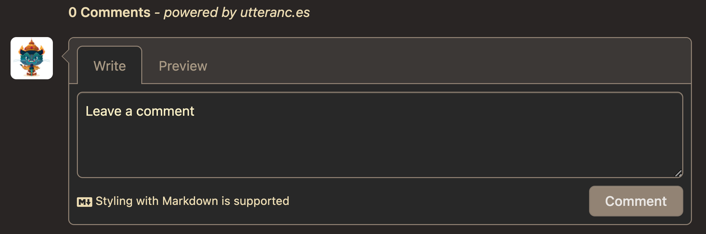

<figure>
    
    <figcaption align="center"> Comments widget by Utterances. </figcaption>
</figure>

I am adding a comments widget to my blog. Now you can comment under the blog posts whenever as long as you have a GitHub account. I've always wanted one for the sole purpose of encouraging interactions and discussions. Just a place where you (readers) can quickly jot down your thoughts/comments/questions. [Hugo](https://gohugo.io/), which is the the framework this website is built on, ships with support for [Disqus](https://disqus.com/). I guess Disqus is fine for general uses, but I wanted something more lightweight, free of ads, and has Markdown support. Luckily I came across [Utterances](https://utteranc.es/) today. It's an open-source comments widget that is built on GitHub Issues, developed by [Jeremy Danyow](https://github.com/jdanyow) (Thank you!). I like its simplistic aesthetics and even better, there are multiple (dark) themes you can choose from. Most importantly, it supports Markdown in the comments. I think it would be even better if there is LaTeX support in the future! The general setup is quite simple and I think the [official guide](https://utteranc.es/) is all you really need.

While setting it up on my website (based on the [Congo](https://github.com/jpanther/congo) theme for Hugo) by directly following the instructions, I encountered two small problems. One is the positioning of the comments widget, which is centrally aligned by default but was just sitting a bit too far to the right in my current layout. My way of mitigating this is to add a `<div>` tag with a `class` attribute which I call `comment` to the `comments.html` file (placed under `layouts/partials/`), which contains the `<script>` tag for Utterances. Then inside `custom.css` (under `assets/css/`) I added the following:

```css
.comment {
  width: 80%;
  margin-left: -5%;
  margin-top: 3em;
  box-shadow: 0 0 5px #ccc;
  border-radius: 10px;
}
```

This places the comments widget in a position to my liking. 

The other problem is related to where the comment widget shows up. By default, having the `comments.html` file in the `layouts/partials/` directory will make the widget appear in any page with an `index.md` associated with it. This is not the behavior I want because ideally the comments section should be restricted to blog posts only. There is a simple way to add a knob for this in Congo. First, inside `config/_default/params.toml`, I added `showComment = true` under the `[article]` section. This allows us to have a theme parameter `article.showComment` that can be set to `false` if we want to hide the comments section in a particular page. Then to link this knob to the Utterances widget, I inserted `{{ if .Params.showComment | default (.Site.Params.article.showComment | default true) }}` at the beginning of `comments.html`.


This is what my final `comments.html` looks like:

```html
{{ if .Params.showComment | default (.Site.Params.article.showComment | default true) }}
    <div id="comment">
        <script src="https://utteranc.es/client.js"
        repo="ruihao-li/ruihao-li.github.io"
        issue-term="pathname"
        label="comment"
        theme="gruvbox-dark"
        crossorigin="anonymous"
        async>
        </script>
    </div>
{{ end }}
```

## Update

I just updated Congo to v2.3.0 today (July 6, 2022) and it now comes with the `showComments` support. See the implementation in `layouts/_default/single.html`. So to display the Utterances widget in your blog posts, simply provide the script in `layouts/partials/comments.html` and set the `showComments` parameter to `true` in your `config/_default/params.toml` file.