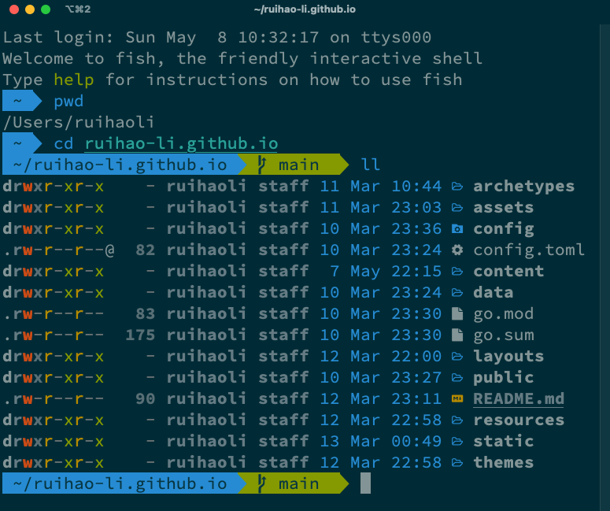

This weekend I spent some time tweaking the Terminal on my Mac with iTerm2 and Fish shell. Why did I do it? First of all, I have been quite fed up with the boring black-and-white look of the default Terminal app. In my opinion, the introduction of multiple colors together with glyphs/icons not only makes it look better visually, it also helps one distinguish different contents (e.g. directories, files) more easily. Moreover, I just want more customizations and features like autosuggestions to make working with command lines a little more efficient. So below are the ingredients I used to customize my Terminal and instructions for some key steps.

## Ingredients:
- [iTerm2](https://iterm2.com/): A popular terminal emulator for macOS
	- *Colors*: I personally use [Solarized Dark](https://ethanschoonover.com/solarized/)
		- Download Solarized
		- Unzip and double click on the the color scheme `Solarized Dark.itermcolors` under the directory `/iterm2-colors-solarized`
		- Open iTerm2's Preferences &rarr; Profiles &rarr; Colors, and select the theme under Color Presets
	- *Text*: We need one of the [Nerd Fonts](https://github.com/ryanoasis/nerd-fonts) to render the glyphs/icons; I chose two of them
		- Meslo Nerd Font: Downloaded from the [Tide](https://github.com/IlanCosman/tide) repo; this particular font contains all the glyphs needed
		- Source Code Pro Nerd Font: Installed on Homebrew via `brew tap homebrew/cask-fonts` (only need to run this once) and then `brew install --cask font-source-code-pro`; This is the font I'd like to use in text
		- Alternatively, all the Powerline Fonts can be installed based on [this repo](https://github.com/powerline/fonts)
		- Go to iTerm2's Preferences &rarr; Profiles &rarr; Text, under Font, choose `Source Code Pro (for Powerline)` or any font you like; select Use a different font for non-ASCII text, then choose `MesloLGS NF` under Non-ASCII Font
	- I also resize the New Windows to be 120 columns and 40 rows under the Window panel
- [Fish shell](https://fishshell.com/): A great alternative to `bash` and `zsh`
	- Installation: `brew install fish`
	- Set fish as the default shell:
		- Add the shell to `/etc/shells` with
			`echo /usr/local/bin/fish | sudo tee -a /etc/shells`
		- Change the default shell with
			`chsh -s /usr/local/bin/fish`
	- [Oh My Fish](https://github.com/oh-my-fish/oh-my-fish): Package manager for customizing the fish shell
		- Check all the themes contained in Oh My Fish: `omf theme`
		- I installed the [Agnoster](https://github.com/oh-my-fish/theme-agnoster) theme: `omf install agnoster`
		- Apply the theme: `omf theme agnoster`
	- [Fisher](https://github.com/jorgebucaran/fisher): Plugin manager for fish
		- See all the plugins and prompts [here](https://github.com/jorgebucaran/awsm.fish)
- [Exa](https://the.exa.website/): Replacement for `ls`
	- Installation: `brew install exa`
	- Customized `ll` and `lla`: 
		- Find fish config file (`config.fish`) in `~/.config/fish`
		- Add the following lines to the config file (I got this trick from the great [Takuya Matsuyama](https://www.craftz.dog/)):
			```powershell
			if type -q exa
				alias ll "exa -l -g --icons"
				alias lla "ll -a"
			end

OK, there you go. I will update this post in the future if there are new elements added to my Terminal customization.