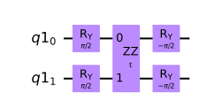
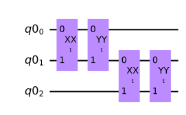
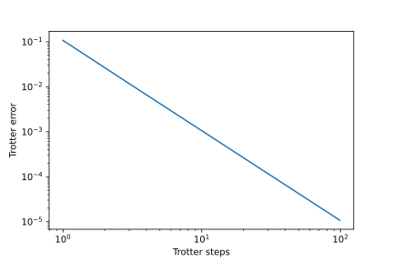

A few weeks ago I participated in the [IBM Quantum Spring Challenge 2022](https://research.ibm.com/blog/quantum-spring-challenge-2022), which was a fun challenge to do because one of the topics covered is actually close to my heart, which is on quantum simulations of many-body systems in condensed matter physics. In these problems, we investigated a well-known phenomenon (to the condensed matter physics community, of course) called [Anderson localization](https://en.wikipedia.org/wiki/Anderson_localization) and one called [many-body localization](https://en.wikipedia.org/wiki/Many_body_localization), which I happened to gain some exposure to during the [MAGLAB Theory Winter School](https://nationalmaglab.org/news-events/events/for-scientists/winter-theory-school) earlier this year and is still an active topic of research. The majority of this Challenge was about introducing and reproducing some of the results from this nicely written [quantum transport paper](https://www.nature.com/articles/s41534-022-00528-0) by Karamlou et al. I will split the full discussion into three parts. This blog post will cover the first part, where we will set up the framework for investigating many-body physics on a quantum computer. This includes building the tight-binding model for a 1-D quantum chain and using Trotterization for simulating dynamics of the quantum states.

The other topic of the Quantum Challenge was quantum chemistry calculations with the variational quantum eigensolver (VQE), which I do not intend to discuss this time. Interested readers are encouraged to take a look at the original announcement linked above for more details. Here is the [official Github repository](https://github.com/qiskit-community/ibm-quantum-spring-challenge-2022) if you want to have a go at the challenge problems. Without further ado, let us begin our discussion.

## Tight-binding model of a quantum chain

The tight-binding model would be the building block for studying the many-body physics that will be discussed throughout this post. In layman's terms, the tight-binding model describes a solid-state system where most electrons are "tightly bound" to their nuclei, which sit at the fixed lattice sites. Only a few valence electrons are loosely bound and therefore can "hop" to the neighboring sites. This hopping action is what leads to an extended Bloch wavefunction, which is the electron wavefunction in the presence of a period lattice potential. The most common way of writing a (spinless) tight-binding model in condensed matter physics would be in the [second-quantization](https://en.wikipedia.org/wiki/Second_quantization) form:


\begin{equation}
H_\text{tb}/\hbar =  \sum_{i}\epsilon_{i} c_i^\dagger c_i + \sum_{\langle i,j\rangle}J_{ij}\left( c_i^\dagger c_j + \text{h.c.}\right),
\end{equation}

where \\(c_i^\dagger\\) and \\(c_i\\) are the creation and annihilation operators for the electron at site \\(i\\), respectively, \\(\mu_i\\) are the on-site potentials, and \\(J_{ij}\\) are the elements of a symmetric matrix representing the hopping strengths. Moreover, \\(\langle i,j\rangle\\) denotes any pair of neighboring sites. To simulate this fermionic system on a gate-based quantum computer which is built on qubits, we need a similar notion for the ladder operators (i.e., creation and annihilation operators) for two-level systems: \\(c^\dagger \ket{0} \to \ket{1}\\) and \\(c\ket{1} \to \ket{0}\\). One way of representing them would be to use the Pauli gates:

$$
\begin{split}
    & c_i^\dagger = \frac{1}{\sqrt 2}(X_i + iY_i), \\\\
    & c_i = \frac{1}{\sqrt 2}(X_i - iY_i).
\end{split}
$$

Plugging them into Eq. (1) and assuming the hoppings are homogeneous such that they can be described by a single parameter \\(J\\), we obtain

\begin{equation}
H_\text{tb}/\hbar = \sum_i \epsilon_i Z_i + J\sum_{\langle i,j\rangle}(X_i X_j + Y_i Y_j),
\end{equation}
where we have neglected a constant term (proportional to the identity operator) that would not have any impact on the dynamics of the system.

## Trotterization

One of the things we care about in quantum simulations is the time-evolution of the quantum system. This is determined by the unitary operator \\(e^{-iHt/\hbar}\\) in quantum mechanics, where \\(H\\) is the time-independent Hamiltonian, which is \\(H_\text{tb}\\) in the case of our 1-D quantum chain. Now, to execute the time evolution unitary on a gate-based quantum computer, one must decompose it into a product of one- and two-qubit gates that can be implemented on the quantum computer. One method to accomplish this is called [Trotterization](https://qiskit.org/documentation/stubs/qiskit.synthesis.SuzukiTrotter.html), which essentially performs a discretized approximation to the continuous time evolution. To demonstrate it, let us consider a simple *three-site* system. The time-evolution unitary of this system is given by
$$
\begin{split}
U_\text{tb}(t) &= \exp\left[\frac{-it}{\hbar}\left(H_\text{tb}^{(0,1)} + H_\text{tb}^{(1,2)}\right)\right] \\\\
&\approx \left[\exp\left(\frac{-it}{n\hbar}H_\text{tb}^{(0,1)}\right) \exp\left(\frac{-it}{n\hbar}H_\text{tb}^{(1,2)}\right) \right]^n,
\end{split}
$$
where in the second step we have applied Trotterization and \\(n\\) is the number of Trotter steps, i.e., discrete time steps. Within each two-site subsystem, the Pauli operator pairs \\(X_i X_j\\) and \\(Y_i Y_j\\) commute with each other. Therefore, with \\(J = 1\\) and \\(\epsilon_i = 0\\), we can write \\(U_\text{tb}(t)\\) as
$$
\begin{split}
U_\text{tb}(t) &\approx \left\\{\exp\left[\frac{-it}{n} \left(X_0 X_1 + Y_0 Y_1 \right) \right] \exp\left[\frac{-it}{n}\left(X_1 X_2 + Y_1 Y_2 \right) \right] \right\\}^n \\\\
&= \left[\exp\left(\frac{-it}{n}X_0 X_1\right) \exp\left(\frac{-it}{n}Y_0 Y_1\right) \exp\left(\frac{-it}{n}X_1 X_2\right) \exp\left(\frac{-it}{n}Y_1 Y_2\right) \right]^n \\\\
&= \left[R_{X_0X_1}\left(\frac{2t}{n} \right) R_{Y_0Y_1}\left(\frac{2t}{n} \right) R_{X_1X_2}\left(\frac{2t}{n} \right) R_{Y_1Y_2}\left(\frac{2t}{n} \right) \right]^n,
\end{split}
$$
where \\(R_{X_iX_j}\\) and \\(R_{Y_iY_j}\\) are parametric two-qubit \\(X\otimes X\\) and \\(Y\otimes Y\\) interaction gates between qubits \\(i\\) and \\(j\\). They are sometimes referred to as the Ising gates. Please see [RXXGate](https://qiskit.org/documentation/stubs/qiskit.circuit.library.RXXGate.html) and [RYYGate](https://qiskit.org/documentation/stubs/qiskit.circuit.library.RYYGate.html) for more details. In general, for an \\(n\\)-qubit system, the time-evolution unitary can be written as
$$
U_\text{tb}(\Delta t) \approx \prod_{j\in\text{odd}} R_{X_j X_{j+1}}(2\Delta t) R_{Y_j Y_{j+1}}(2\Delta t) \prod_{k\in\text{even}} R_{X_k X_{k+1}}(2\Delta t) R_{Y_k Y_{k+1}}(2\Delta t),
$$
where \\(\Delta t = t/n\\) is the discretized time step.

We are now just one step shy of implementing \\(U_\text{tb}(t)\\) on a quantum computer, that is, to further decompose the \\(R_{XX}\\) and \\(R_{YY}\\) gates into a set of gates that are native to the quantum hardware, such as the CNOT gate and single-qubit rotation gates. For this, let us introduce another Ising gate, [RZZGate](https://qiskit.org/documentation/stubs/qiskit.circuit.library.RZZGate.html) \\(R_{ZZ}\\). It is not hard to verify that this two-qubit gate can be decomposed as a single-qubit rotation gate \\(R_Z = \exp(-i\theta Z/2)\\) sandwiched between two CNOT gates. Specifically, \\(R_{ZZ}(\theta) = \text{CNOT}\\, R_Z(\theta)\\, \text{CNOT}\\). Then by working out the explicit matrix representations, one can show that the \\(R_{XX}\\) gate has the following decomposition,



while the \\(R_{YY}\\) gate is decomposed as


With the above setup, we are ready to build the Trotterized quantum circuit for a general \\(n\\)-site quantum chain using Qiskit. First, we need to import some necessary packages.

```python
import numpy as np
import matplotlib.pyplot as plt
from qiskit import QuantumCircuit, QuantumRegister
from qiskit.circuit import Parameter
import qiskit.quantum_info as qi
```

We then define the `Trot_qc` function for the Trotterized quantum circuit.

```python
def Trot_qc(num_qubits, t=Parameter("t")):
    """
    Creates the Trotterized quantum circuit at a given time step
    for a 1-D tight-binding model.

    Args:
        t (float): The Trotter parameter.
        num_qubits (int): The number of qubits in the circuit.

    Returns:
        qiskit.circuit.QuantumCircuit: The Trotterized quantum circuit.
    """

    def ZZ_gate(t):
        ZZ_qr = QuantumRegister(2)
        ZZ_qc = QuantumCircuit(ZZ_qr, name='ZZ')
        ZZ_qc.cnot(0,1)
        ZZ_qc.rz(2 * t, 1)
        ZZ_qc.cnot(0,1)
        # Convert custom quantum circuit into a gate
        ZZ = ZZ_qc.to_instruction()
        return ZZ

    def XX_gate(t):
        XX_qr = QuantumRegister(2)
        XX_qc = QuantumCircuit(XX_qr, name='XX')
        XX_qc.ry(np.pi/2, [0,1])
        XX_qc.append(ZZ_gate(t), [0,1])
        XX_qc.ry(-np.pi/2, [0,1])
        XX = XX_qc.to_instruction()
        return XX

    def YY_gate(t):
        YY_qr = QuantumRegister(2)
        YY_qc = QuantumCircuit(YY_qr, name='YY')
        YY_qc.rx(-np.pi/2, [0,1])
        YY_qc.append(ZZ_gate(t), [0,1])
        YY_qc.rx(np.pi/2, [0,1])
        YY = YY_qc.to_instruction()
        return YY
    
    Trot_qr = QuantumRegister(num_qubits)
    qc = QuantumCircuit(Trot_qr, name='Trot')

    for i in range(num_qubits - 1):
        qc.append(XX_gate(t), [Trot_qr[i], Trot_qr[i+1]])
        qc.append(YY_gate(t), [Trot_qr[i], Trot_qr[i+1]])
        
    return qc
```

We can inspect the circuit for 3 qubits by calling the `QuantumCircuit.draw()` method:



Last but not least, to see if we have implemented Trotterization correctly, we may compute the [process fidelity](https://qiskit.org/documentation/stubs/qiskit.quantum_info.process_fidelity.html) between the Trotterized quantum channel and the exact time-evolution unitary. We define the exact time-evolution unitary as follows:

```python
from qiskit.opflow import I, X, Y, Z

def U_tb(t):
    """Time-evolution unitary for 3 qubits."""
    # Interactions (I is the identity matrix; X and Y are Pauli matricies;
    # ^ is a tensor product)
    XXs = (I^X^X) + (X^X^I)
    YYs = (I^Y^Y) + (Y^Y^I)
    H_tb = XXs + YYs
    return (t * H_tb).exp_i()
```

On the other hand, the approximate unitary based on Trotterization is constructed as follows:

```python
def U_trot_tb(t_target, trotter_steps, num_qubits):
    """
    Creates the Trotterized time-evolution unitary for a 
    1-D tight-binding model.
    
    Args:
        t_target (float): The total time evolved.
        trotter_steps (int): The number of Trotter steps.
        num_qubits (int): The number of qubits in the circuit.

    Returns:
        qiskit.quantum_info.Operator: The operator corresponding to 
        the Trotterized time-evolution unitary.
    """

    t = Parameter("t")
    qr = QuantumRegister(num_qubits)
    qc = QuantumCircuit(qr)

    for _ in range(trotter_steps):
        qc.append(Trot_qc(num_qubits, t), qr)
    qc = qc.bind_parameters({t: t_target/trotter_steps})
    return qi.Operator(qc)
```

Finally, we can plot how the Trotter error (= 1 - process fidelity) changes as we increase the number of Trotter steps.

```python
t_target = 0.5 # total time evolved
U_target = U_tb(t_target)

steps=np.arange(1,101,2)

fidelities=[]
for n in steps:
    U_trotter = U_trot_tb(t_target, n, 3)
    fidelity = qi.process_fidelity(U_trotter, target=U_target)
    fidelities.append(fidelity)

plt.figure(facecolor='white')
plt.loglog(steps, 1 - np.array(fidelities))
plt.ylabel('Trotter error')
plt.xlabel('Trotter steps')
plt.show()
``` 

Here is how the plot looks like:



Yay :tada:! The trotter error decreases as the number of Trotter steps increases, suggesting that we have indeed implemented Trotterization correctly.

So here comes the end of the first part. In the next post, we will see how we can use the Trotterized quantum circuit that we just built to study phenomena including the quantum random walk and Anderson localization on a 1-D quantum chain. Stay tuned!
