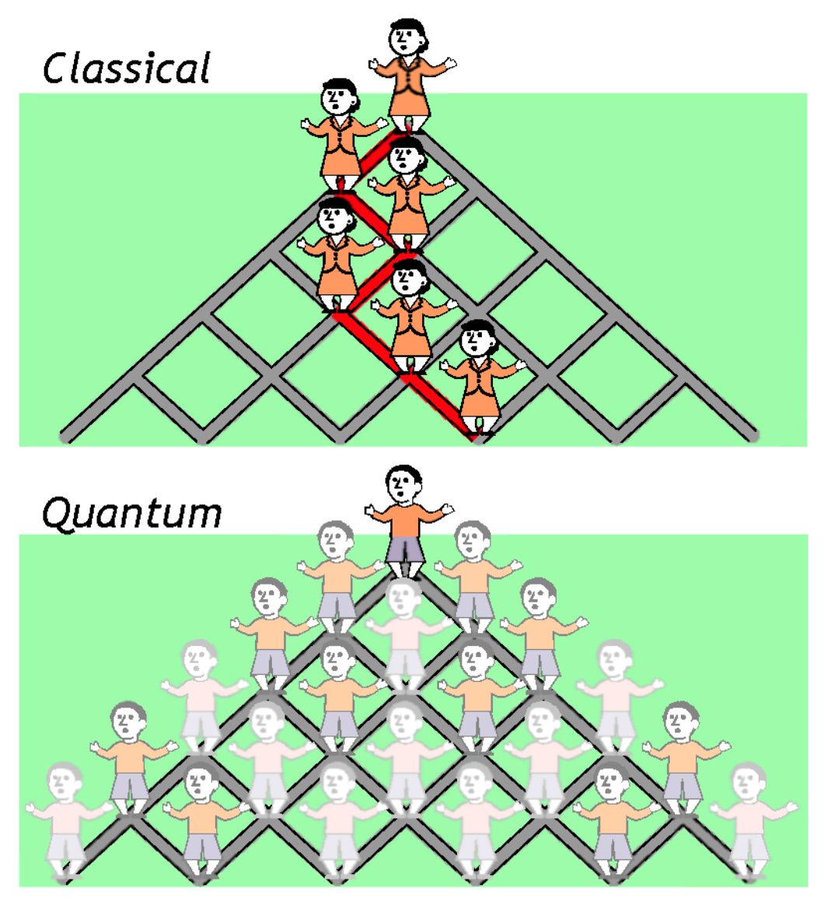
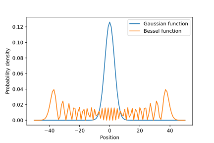
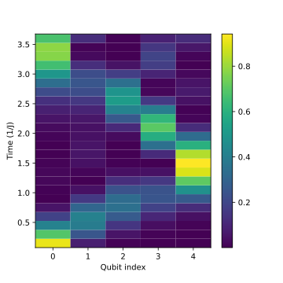
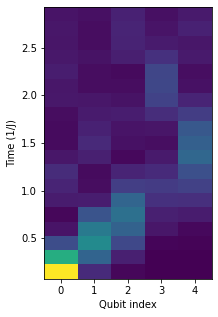
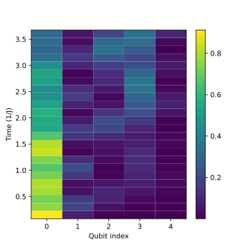
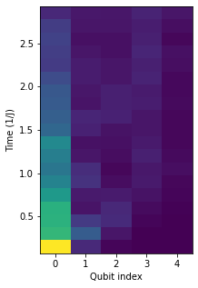

As promised in the [previous blog post](/blog/ibm-spring-challenge-1/), we will now continue our journey into the world of many-body physics simulations with quantum computers. In this post, we want to address the question of how a particle such as an electron, propagates through an intrinsically quantum system, i.e., the 1-D quantum chain that we built previously. Remember everything we discussed so far has not taken into account *disorder* that is generally present in realistic condensed matter systems. Disorder is something that generically breaks some symmetries of the system Hamiltonian and/or leads to deviations from the lattice periodicity. When disorder is present, all the sites in a lattice are no longer equivalent. So another question naturally arises: how would disorder affect the quantum transport? The exploration of this general question has led to wonderful discoveries of various localization effects in disordered systems. Here we will touch on one of them, Anderson localization, which was first discovered by the great physicist [Philip W. Anderson](https://en.wikipedia.org/wiki/Philip_W._Anderson) in 1958 [1]. One interesting thing to note is that the dimensionality of a system has a direct impact on Anderson localization. For example, according to the scaling theory of localization [2], in 1- and 2-D, a system will be a perfect insulator in the thermodynamic limit (simply put, when the system size is taken to infinity). Therefore, Anderson localization must happen in one- and two-dimensional disordered systems regardless of the disorder strength! However, in 3-D, Anderson localization is a critical phenomenon where the system undergoes a [metal-insulator transition (MIT)](https://en.wikipedia.org/wiki/Metal%E2%80%93insulator_transition). This means that localization happens only when the disorder strength exceeds a certain threshold. Even though this is certainly one of the most interesting aspects of Anderson localization, we will not explore it here for the sake of simplicity. We will again stick to the 1-D system as in the previous post.

## Quantum random walk

Classical random walk is a random process that is prevalent in many phenomena in nature, such as the motion of macroscopic particles in liquids and gases known as [Brownian motion](https://en.wikipedia.org/wiki/Brownian_motion) and even the price of a fluctuating stock. In the most rudimentary version of a *symmetric* classical random walk on a lattice, at each time step, the probabilities of the particle jumping to any of the neighboring sites are the same. In 1-D, this means that the particle can move one site to the left or right with equal probability (50%) each time. A well-established result for a symmetric random walk is that in the continuous-time limit, the probability of finding the particle at time \\(t\\) at position \\(r\\) (from the origin) follows a Gaussian distribution:


$$
P_\text{classical}(r, t) = \frac{1}{\sqrt{2\pi t}} e^{-r^2/2t},
$$

where we have assumed the distance of each jump to be 1. Therefore, the standard deviation of this probability distribution scales as \\(\sigma_\text{classical}\propto \sqrt{t}\\). Since \\(\langle r \rangle = 0\\), this suggests that the mean-square-root displacement of the particle, which quantifies the spatial propagation of the particle relative to the origin, also scales *diffusively* with time as \\(\sqrt{\langle r^2\rangle} \propto \sqrt{t}\\).

Since we are interested in particle propagation in a quantum system, we will need to deal with *quantum random walks* instead. In this case, the intrinsic quantum nature including superposition and interferences among different wavefunctions will lead to a qualitative difference from the classical counterpart. Here is a somewhat intuitive way to think about the difference between them. Imagine a "classical walker" who decides whether to step left or right by tossing a coin with two possible outcomes \\(+\\) and \\(-\\), with probabilities \\(P_+\\) and \\(P_-\\), respectively. After each toss, they would look at the result and decide which way to go. So the classical random walk traces a single path within a decision tree. In contrast, a "quantum walker" flips their coin but never looks at the outcome. Instead, at each step, they step *simultaneously* to the left and right with some complex amplitudes \\(A_+\\) and \\(A_-\\) corresponding to probabilities \\(P_+ = \lvert A_+\rvert^2\\) and \\(P_- = \lvert A_-\rvert^2\\). After many iterations the quantum random walk results in an extended wavefunction of the quantum walker that spreads out to all positions in the tree with finite amplitudes. What's more incredible is that these complex amplitudes at different sites add up for any given path and depending on the phase differences, this creates constructive or destructive interferences when measuring the probabilities at the end. A diagram illustrating the ideas above is shown below (taken from [3]).



Due to the critical differences highlighted above, it can be shown that a symmetric quantum random walk in the continuous-time limit will lead to a probability distribution that follows a [Bessel function of the first kind](https://en.wikipedia.org/wiki/Bessel_function#Bessel_functions_of_the_first_kind:_J%CE%B1) [4]:

$$
P_\text{quantum}(r, t) = \lvert J_r(2t) \rvert^2.
$$

Below is a visualization of the two probability distributions for continuous-time classical and quantum random walks:



Moreover, a quantum random walk exhibits *ballistic* propagation with the mean-square-root displacement scaling linearly with time, \\(\sqrt{\langle r^2\rangle} \propto t\\). The quadratic speed-up of quantum random walks versus classical random walks is analogous to the quadratic speed-up of the Grover search algorithm compared to a classical search!

## Simulating a quantum random walk

Let us now simulate the quantum random walk on a 1-D tight-binding chain to see if the result matches the theory prediction above. We will first do this on a simulator and then on a real quantum computer. For this simulation, we consider a 5-site tight-binding lattice whose Hamiltonian is given by

$$
H_\text{tb}/\hbar = J\sum_{i=0}^3(X_i X_{i+1} + Y_i Y_{i+1}).
$$

Again, we have set the on-site potentials to be zero to simulate a clean system without disorder and will use \\(J = 1\\) from here onwards [cf. Eq. (2) in [part I](/blog/ibm-spring-challenge-1/)]. Recall that to simulate the dynamics of a quantum system on a gate-based quantum computer, we employ the *Trotterization* process to discretize the continuous time evolution. Therefore, we use the `Trot_qc` function established in [part I](/blog/ibm-spring-challenge-1/) to build the Trotterized quantum circuit for this 5-site system at any given time. Next, we want to add a particle in the form of an excitation to site 0, i.e., qubit 0. This is done by apply an \\(X\\) gate to flip the qubit from \\(\ket{0}\\) state to \\(\ket{1}\\) state. We modify the `U_trot_tb` function in the previous part slightly to record the Trotterized circuits at all Trotter (time) steps over a given simulation time:

```python
def U_trot_circuits(delta_t, trotter_steps, num_qubits):
    """
    Record a list of Trotterized circuits at all Trotter steps 
    separated by delta_t.
    
    Args:
        delta_t (float): Duration of individual time steps.
        trotter_steps (array): Array of intermediate time steps.
        num_qubits (int): The total number of qubits.

    Returns:
        circuits (list): A list of Trotterized quantum circuits.
    """
    
    t = Parameter("t")
    circuits = []

    for n_steps in trotter_steps:
        qr = QuantumRegister(num_qubits)
        cr = ClassicalRegister(num_qubits)
        qc = QuantumCircuit(qr, cr)

        qc.x(0) # Add an excitation to site 0

        for _ in range(n_steps):
            qc.append(Trot_qc(num_qubits, t).to_instruction(), qr)
        qc = qc.bind_parameters({t: delta_t})
        circuits.append(qc)
    return circuits
```

We can now track the propagation of the particle by keeping track of the probability of finding it on each qubit at different time steps. To simulate this process with a simulator, we will make use of the `statevector_simulator` backend in Qiskit's `Aer` module. For this, we make some additional imports here.

```python
from qiskit import transpile, Aer, IBMQ, execute
from copy import deepcopy
```

Here we define a function that extracts the probabilities of each qubit being in the \\(\ket{1}\\) state at different times using the output state from the `statevector_simulator`.

```python
def probability_density(delta_t, trotter_steps, num_qubits):
    """
    Calculate the probabilities of finding the excitation 
    on each qubit at different time steps.

    Args:
        delta_t (float): Duration of individual time steps.
        trotter_steps (array): Array of intermediate times.
        num_qubits (int): The total number of qubits.

    Returns:
        probability_density (array): The probability density of 
        the excitation at all Trotter steps.
    """

    backend_sim = Aer.get_backend('statevector_simulator')
    circuits = U_trot_circuits(delta_t, trotter_steps, num_qubits)
    probability_density=[]
    
    for circ in circuits:
        transpiled_circ=transpile(circ, backend_sim, optimization_level=3)
        job_sim = backend_sim.run(transpiled_circ)

        # Grab the results from the job.
        result_sim = job_sim.result()
        outputstate = result_sim.get_statevector(transpiled_circ, decimals=5)
        
        ps = []
        # Extract the probability of finding the excitation on each qubit. 
        # (e.g. for 5 qubits, we need "00001", "00010", "00100", "01000", "10000")
        for i in range(num_qubits):
            ps.append(np.abs(outputstate[2**i])**2)
        probability_density.append(ps)
    probability_density = np.array(probability_density)
    return probability_density
```

It's time to simulate the quantum random walk on the 5-site tight-binding lattice and see the results. We choose to evolve the system over 25 steps with a step size of 0.15 for this simulation. We can visualize the results by running the following code,

```python
delta_t = 0.15
trotter_steps = np.arange(1, 25, 1)
num_qubits = 5

prob_density = probability_density(delta_t, trotter_steps, num_qubits)
prob_max, prob_min = np.max(prob_density), np.min(prob_density)

plt.figure(figsize=(5,5), facecolor='white')
plt.pcolormesh(np.arange(0, num_qubits,1), trotter_steps*delta_t, prob_density, vmin=prob_min, vmax=prob_max)
plt.colorbar()
plt.xlabel('Qubit index')
plt.ylabel('Time (1/J)')
plt.savefig("probs_qwr.svg")
```

which produces the plot below:



This result is pretty nice as it shows that the particle excitation traverses the lattice and eventually reflects off the opposite end of the 1-D chain. In principle, the quantum random walk propagates in both directions for all the interim sites. However, quantum interferences among these multiple trajectories alter the particle wavepacket as it evolves in time, leading to the unidirectional transport seen above. Furthermore, it is evident that the displacement of the excitation scales linearly with time, agreeing well with the prediction of quantum random walks.

Performing the same simulation on a real quantum computer is slightly different. Here we can no longer retrieve the statevectors directly from the outputs. Instead, at each time step we will need to send the circuit to the quantum computer many times (specified by the number of `shots`) for execution and extract the probabilities based on the output statistics. During the Challenge, we were given the access to one of IBM's 7-qubit systems `ibm_nairobi`. We can perform the simulation by calling the following function:
```python
def probability_density_exp(delta_t, trotter_steps, num_qubits, shots):
    # Load your IBM Quantum account
    IBMQ.load_account()
    # Get the backend
    provider = IBMQ.get_provider(hub=<hub_name>, group=<group_name>, project=<project_name>)
    backend = provider.get_backend('ibm_nairobi')

    # Create transpiled circuits for hardware execution
    initial_layout = [0 , 1 , 3 , 5 , 4] # Specific to ibm_nairobi topology
    hardware_transpiled_circuits = []

    for circ in U_trot_circuits(delta_t, trotter_steps, num_qubits):
        hardware_circ = deepcopy(circ)
        hardware_circ.measure(range(num_qubits), range(num_qubits))
        hardware_transpiled_circuits.append(
            transpile(hardware_circ, backend, initial_layout=initial_layout, optimization_level=3)
        )
    
    # Run the circuits
    job = execute(hardware_transpiled_circuits, backend=backend, shots=shots)
    exp_results = job.result()

    probability_density_exp = []
    for output in exp_results.get_counts():
        ps = []
        # Extract the probabilities
        keys = ['00001', '00010', '00100', '01000', '10000']
        for key in keys:
            if key in output:
                ps.append(output[key]/shots)
            else:
                ps.append(0.)
        
        probability_density_exp.append(ps)
    return probability_density_exp
```

Below is the result for one of the simulations on the hardware.



Comparing this with the result above from the simulator, despite the similarity, the effect of noise and decoherence (especially at later times) on a real quantum hardware is apparent!

## Anderson localization
Finally, we are coming to Anderson localization. As mentioned before, Anderson localization always happens in 1-D systems when disorder is present. Lattice inhomogeneity causes scattering and leads to quantum interference that tends to inhibit particle propagation, a signature of localization. The wavefunction of a localized particle rapidly decays away from its initial position, effectively confining the particle to a small region of the lattice. This localization phenomenon is a direct consequence of interference between different paths arising from multiple scatterings of the electron by lattice defects. To study this phenomenon, we add back the inhomogeneous on-site potentials to the Hamiltonian, thereby making the lattice sites inequivalent, i.e.,

$$
H_\text{tb}/\hbar = J\sum_{i=0}^3(X_i X_{i+1} + Y_i Y_{i+1}) + \sum_{i=0}^3\epsilon_i Z_i.
$$

One simple way to model disorder within the tight-binding system is through the *Aubry-Andre (AA) model*, where the disorder is replaced by a periodic modulation of the on-site energies, with a spatial period incommensurate with the lattice period. The AA potential is modeled as \\(\epsilon_i = W\cos(2\pi\beta i)\\), where \\(\beta\\) determines the quasicrystal periodicity and \\(W\\) is the disorder strength. Moreover, with the addition of the on-site terms, we also need to modify the Trotterized circuit. Note that exponentiating the \\(Z_i\\) gates for the time-evolution unitary simply leads to \\(R_{Z_i}\\) gates acting on individual qubits. So we can define a `Trot_qc_disorder` circuit based on the `Trot_qc` circuit from [part 1](/blog/ibm-spring-challenge-1/):

```python
def Trot_qc_disorder(num_qubits, t, deltas):
    """
    Generate a Trotterized quantum circuit with disorder.  

    Args:
        num_qubits (int): The total number of qubits.
        t (Parameter): The time parameter.
        deltas (list(Parameter)): The list of disorder parameters.
    
    Returns:
        qiskit.QuantumCircuit: The Trotterized quantum circuit with disorder.
    """

    Trot_qr_disorder = QuantumRegister(num_qubits)
    Trot_qc_disorder = QuantumCircuit(Trot_qr_disorder, name='Trot disorder')

    Trot_gate = Trot_qc(num_qubits, t).to_instruction()
    Trot_qc_disorder.append(Trot_gate, Trot_qr_disorder)
    for i in range(num_qubits):
        Trot_qc_disorder.rz(2 * deltas[i] * t, i)
    return Trot_qc_disorder
```

Let us then define a function that records the Trotterized circuits with finite disorder at all Trotter (time) steps:

```python
def U_trot_circuits_disorder(delta_t, trotter_steps, num_qubits, W, beta):
    """
    Record a list of Trotterized quantum circuits with disorder 
    at all Trotter steps.

    Args:
        delta_t (float): Duration of individual time steps.
        trotter_steps (array): Array of intermediate times.
        num_qubits (int): The total number of qubits.
        W (float): The disorder strength.
        beta (float): The quasicrystal periodicity of the AA model.

    Returns:
        disorder_circuits (list): List of Trotterized quantum circuits with disorder.
    """

    t = Parameter('t')
    deltas = [Parameter('delta_{:d}'.format(idx)) for idx in range(num_qubits)]

    AA_pattern = np.cos(2*np.pi*beta*np.arange(num_qubits))
    disorders = W * AA_pattern
    disorder_circuits = []

    for n_steps in trotter_steps:
        qr = QuantumRegister(num_qubits)
        cr = ClassicalRegister(num_qubits)
        qc = QuantumCircuit(qr, cr)

        qc.x(0)

        for _ in range(n_steps):
            qc.append(Trot_qc_disorder(num_qubits, t, deltas), qr)
            
        qc = qc.bind_parameters({t: delta_t})
        qc = qc.bind_parameters({deltas[idx]: disorders[idx] for idx in range(num_qubits)})
        disorder_circuits.append(qc)
    return disorder_circuits
```

Like in the previous section, we will simulate the particle propagation with disorder on a simulator. Here is how it looks like:



Comparing with the quantum random walk result, it is clear that in the presence of the AA disorder, the particle tends to be localized in its initial position (qubit 0) as time evolves. So we successfully see the effect of Anderson localization in this 1-D system! Again, running the same simulation on a quantum computer we see a degradation in quality of the results due to noise, but we can still reach the same conclusion in this case:



## Conclusion

It's been a long post to get to this point, but just to conclude, we have successfully simulated the particle propagation in a 1-D quantum chain with and without disorder on both a simulator and a real quantum computer provided by IBM. In the case of no disorder, we saw behaviors of a quantum random walk, while is distinct from a classical random walk. In the presence of disorder, we saw the effect of Anderson localization, i.e., the particle tends to localize in its initial position over time. In the next and final post of this series, we will look into a more complex example of localization beyond the single-particle picture we have been adhering to so far, that is, many-body localization. The question there is: *does localization still happen when we take into account particle interactions?* See you in the next one!

---

## References

1. [P. W. Anderson, Absence of Diffusion in Certain Random Lattices. *Phys. Rev.* 109, 1492 (1958).](https://journals.aps.org/pr/abstract/10.1103/PhysRev.109.1492)

2. [E. Abrahams, P. W. Anderson, D. C. Licciardello, and T. V. Ramakrishnan, Scaling Theory of Localization: Absence of Quantum Diffusion in Two Dimensions. *Phys. Rev. Lett.* 42, 673 (1979).](https://journals.aps.org/prl/abstract/10.1103/PhysRevLett.42.673)

3. [K. Manouchehri and J. B. Wang, Solid State Implementation of Quantum Random Walks on General Graphs. *AIP Conf. Proc.* 1074, 56 (2008).](https://aip.scitation.org/doi/abs/10.1063/1.3037138)

4. [J.Kempe, Quantum random walks - an introductory overview. arXiv:quant-ph/0303081 (2003).](https://arxiv.org/abs/quant-ph/0303081)
