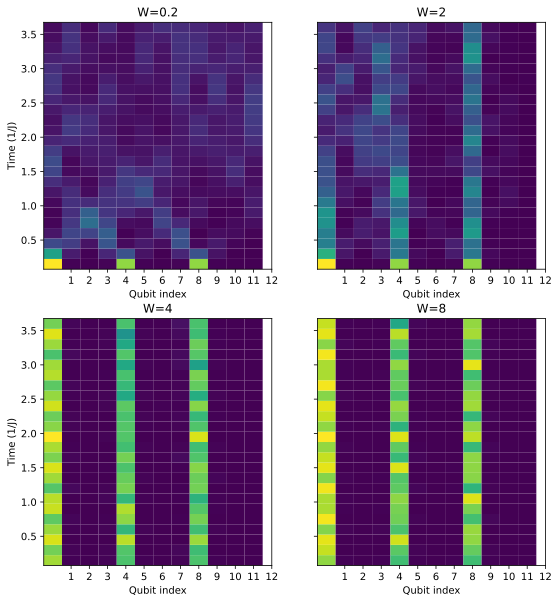
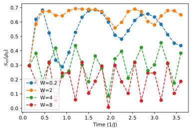
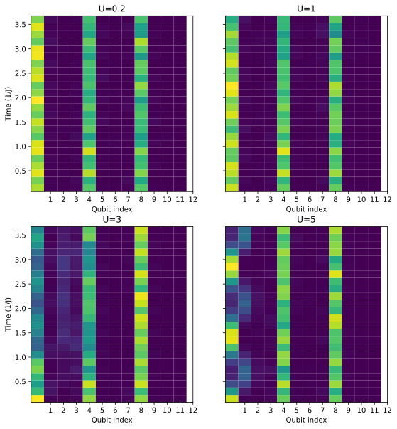
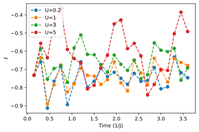
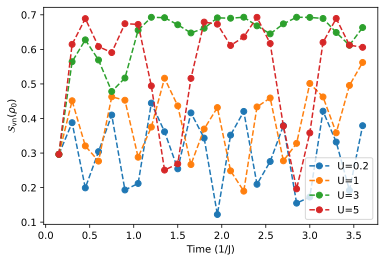

<!-- 

 -->



This is the third and final blog post of the 2022 IBM Spring Challenge series where I introduce some basic concepts and implementations of quantum simulation of many-body physics. Just a quick recap here: In the first post we set up the quantum system that we wanted to investigate using a 1-D tight-binding model, and we discussed how to utilize the Trotterization procedure to implement the time-evolution of the system on a gate-based quantum computer. In the second post, using the tools developed previously, we simulated the propagation of one particle excitation on a 1-D quantum chain with and without disorder on both a simulator and a real quantum computer. We saw the behavior of a quantum random walk when there is no disorder and Anderson localization when disorder is present. We emphasize that the tight-binding model that we have been working with so far does not include particle-particle interactions. So Anderson localization is really just a single-particle, i.e., non-interacting, effect. Then naturally we are prompted to ask the question of what happens when we do take interactions into account. This leads to the rich physics of [many-body localization (MBL)](https://en.wikipedia.org/wiki/Many_body_localization) that we will touch on in this post. Please feel free to check out [part I](/blog/ibm-spring-challenge-1) and [part II](/blog/ibm-spring-challenge-2) before continuing.

## Thermalization vs. Localization

To talk about many-body localization, it is beneficial to first introduce the concept of thermalization, or thermal equilibrium, following Ref. [1]. Thermalization in a closed classical system hinges on the powerful *ergodic hypothesis*, which states that over a long period of time all microstates of the system are accessed with equal probability. However, this notion of ergodicity does not directly apply to quantum systems. Here is a simple example to see why. Let us consider an isolated quantum many-body system with Hamiltonian \\(H\\). The generic initial non-equilibrium state \\(\ket{\psi(0)}\\) can be expanded over the basis of many-body eigenstates \\(\ket{\alpha}\\) as \\(\ket{\psi(0)} = \sum_\alpha A_\alpha \ket{\alpha}\\). After the quantum evolution over an arbitrarily long time \\(t\\), the state becomes

$$
\ket{\psi(t)} = e^{-iHt} \ket{\psi(0)} = \sum_\alpha A_\alpha e^{-iE_\alpha t} \ket{\alpha},
$$

where \\(E_\alpha\\) is the energy of the eigenstate \\(\ket{\alpha}\\). Then the probability of finding the system in a given eigenstate \\(\ket{\alpha}\\), \\(p_\alpha = \lvert A_\alpha\rvert^2\\), is set by the choice of the initial state and does not change over time. So unlike the classical case, the time evolution of a quantum system does not uniformly sample all states in the Hilbert space. Therefore, for quantum ergodicity, we should instead demand that starting from a generic initial state the system's observables (few-body operators) settle to values given by the *microcanonical* ensembles at sufficiently long times. The infinite-time average of a physical observable \\(O\\) is given by

$$
\langle O \rangle = \lim_{T\to\infty} \frac{1}{T}\int_0^T dt\ \langle\psi(t)\vert O\vert \psi(t)\rangle  = \sum_\alpha p_\alpha \langle\alpha\vert O\vert \alpha\rangle.
$$

Since \\(p_\alpha\\) are fixed by the initial state, the natural way to ensure that an observable \\(O\\) reaches a thermal expectation value at long times for generic initial states is to assume that the expectation values in individual eigenstates \\(\langle\alpha\vert O\vert \alpha\rangle\\) agree with the microcanonical ensemble. This is the essence of the [eigenstate thermalization hypothesis (ETH)](https://en.wikipedia.org/wiki/Eigenstate_thermalization_hypothesis), which is an important concept in this subject. More precisely, the ETH states that in ergodic systems individual many-body eigenstates have thermal observables that are identical to microcanonical ensemble values at energy \\(E = E_\alpha\\), i.e., \\(\langle\alpha\vert O\vert \alpha\rangle \approx \langle O\rangle_\text{mc}(E)\\). The microcanonical ensemble average can be written as

$$
\langle O\rangle_\text{mc}(E) = \lim_{\Delta E\to 0}\frac{1}{N(E, \Delta E)}\sum_{\alpha: E_\alpha\in [E-\Delta E, E+\Delta E]} \langle\alpha\vert O\vert \alpha\rangle,
$$

where \\(N(E, \Delta E)\\) is the number of eigenstates in the system that are within \\(\Delta E\\) of energy \\(E\\).

After a fairly long digression, rather than diving further into the glory details of the ETH and its implications, we will come back to, in some sense, the other end of the spectrum, MBL, which is known to violate the ETH and hence does not thermalize. Generally speaking, thermalization requires that different parts of ergodic systems exchange energy and particles, and consequently leads to conduction. On the other hand, localization leads to the absence of diffusion, suppressing transport. We have seen the example of Anderson localization, where a disorder potential can completely change the nature of single-particle eigenstates in a non-interacting system. However, interactions between particles are inevitable in realistic systems. It is conceivable that interactions may open up new transport channels, e.g., a high-energy localized state may decay to produce excitations at lower energies, potentially restoring transport. Therefore, to understand the fate of localization in the presence of particle interaction is not a trivial problem. In particular, Basko, Aleiner, and Altshuler (BAA) first studied the stability of the Anderson insulator against short-ranged interactions and concluded that the interacting model enters a localized phase termed the MBL phase in arbitrary dimensions below a certain critical temperature [2]. Later, by studying a 1-D disordered fermionic chain, it was pointed out that the MBL phase can persist even at infinite temperature [3]. More recent developments however challenged the conclusion of BAA. It was argued that in high dimensions \\(d>1\\) small thermal inclusions can trigger avalanches in the system that destroy the MBL phase [4,5]. The reconciliation of these two results is still an open problem.

## The Heisenberg model

Following the history of this subject, the introduction of the fermionic and spin-chain lattice models has definitely opened the door to studying many interesting properties of MBL in (classical) numerical simulations. This is exactly the setup we have built up in the previous parts of the challenge. Here we will do something different from the setup in the original IBM Challenge Problem 3. On top of the tight-binding model used to study Anderson localization in [part II](/blog/ibm-spring-challenge-2/), we will add an additional \\(ZZ\\)-interaction term. So the tight-binding Hamiltonian is given by

$$
H_\text{tb}/\hbar = J\sum_{i=0}^{n-2} (X_i X_{i+1} + Y_i Y_{i+1}) + U \sum_{i=0}^{n-2} Z_i Z_{i+1} +\sum_{i=0}^{n-2}\epsilon_i Z_i,
$$

where \\(n\\) is the number of sites in the 1-D chain. Readers with a condensed matter physics background may recognize that this is exactly the so-called [Heisenberg XXZ model](https://en.wikipedia.org/wiki/Quantum_Heisenberg_model). In fact, the Heisenberg model has become the paradigmatic model for studying MBL physics. The reason for the additional term should be obvious by doing the [Jordan-Wigner transformation](https://en.wikipedia.org/wiki/Jordan%E2%80%93Wigner_transformation), which maps the spin-chain Hamiltonian above to a spinless fermionic chain in the second-quantization form given by

$$
H_\text{tb}/\hbar = J\sum_{i=0}^{n-2} (c_i^\dag c_{i+1} + \text{h.c.}) + U \sum_{i=0}^{n-2} n_i n_{i+1} + \sum_{i=0}^{n-2} \epsilon_i n_i,
$$

where \\(n_i \equiv c_i^\dag c_i\\) is the density operator for site \\(i\\). Hence, we see that the additional \\(U\\)-term gives rise to the two-body interaction between neighboring sites. Without it, the tight-binding model is a free-fermion model, which is suited for the study of Anderson localization but not many-body localization. So here we will simulate the MBL phase in a disordered Heisenberg XXZ spin chain. We will again set \\(J = 1\\) and the model thus has two free parameters: the *interaction strength* \\(U\\) and the *disorder strength* \\(W\\). Recall that \\(W\\) controls the onsite potentials through the Aubry-Andre model, \\(\epsilon_i = W\cos(2\pi\beta i)\\), with \\(\beta\\) being related to the quasicrystal periodicity. 

One interesting aspect of the 1-D Heisenberg XXZ model is its phase diagram. In the limit \\(U\to 0\\) with some finite \\(W\\), i.e., when there is no interaction, this model is equivalent to free fermions moving in a disordered potential and therefore, the states are Anderson localized. Turning on the interaction will result in the MBL phase. Furthermore, for fixed and not very strong disorder (\\(W/U \sim 1\\)), it was found that tuning the interaction strength \\(U\\) above some critical value \\(U^\ast\\) will lead to delocalization. On the other hand, if we fix \\(U\\) and increase the disorder strength \\(W\\), we will see a transition from a delocalized (thermal) phase to the MBL phase when the \\(W\\) goes above a critical value \\(W^\ast\\). Therefore, in 1-D interacting systems there exists a metal-insulator transition, which is distinct from non-interacting systems that always Anderson localize in the thermodynamic limit, as mentioned in the [previous post](/blog/ibm-spring-challenge-2). A schematic illustrating the phase diagram of the XXZ spin chain is shown below.

<figure>
    
    <figcaption align="center"> Phase diagram of Heisenberg XXZ spin chain as a function of interaction (top) and disorder strength (bottom). Here <i>Jz</i> denotes the interaction strength, equivalent to <i>U</i> in our formalism. Figure taken from Ref. [1]. </figcaption>
</figure>

## Imbalance and entanglement entropy

## References

1. [D. A. Abanin, E. Altman, I. Bloch, and M. Serbyn, Colloquium: Many-body localization, thermalization, and entanglement. *Rev. Mod. Phys.* 91, 021001 (2019).](https://journals.aps.org/rmp/abstract/10.1103/RevModPhys.91.021001)

2. [B. Basko, A. Aleiner, and A. Altshuler, Metal-insulator transition in a weakly interacting many-electron system with localized single-particle states. *Ann. Phys.* 321, 1126 (2006).](https://www.sciencedirect.com/science/article/pii/S0003491605002630?via%3Dihub)

3. [V. Oganesyan and D. V. Huse, Localization of interacting fermions at high temperature. *Phys. Rev. B* 75, 155111 (2007).](https://journals.aps.org/prb/abstract/10.1103/PhysRevB.75.155111)

4. [W. De Roeck and F. Huveneers, Stability and instability towards delocalization in many-body localization systems. *Phys. Rev. B* 95, 155129 (2017).](https://journals.aps.org/prb/abstract/10.1103/PhysRevB.95.155129)

5. [D. J. Luitz, F. Huveneers, and W. De Roeck, How a Small Quantum Bath Can Thermalize Long Localized Chains. *Phys. Rev. Lett.* 119. 150602 (2017).](https://journals.aps.org/prl/abstract/10.1103/PhysRevLett.119.150602)
   
<!-- 3. [R. Nandkishore and D. A. Huse, Many-Body Localization and Thermalization in Quantum Statistical Mechanics. *Annu. Rev. Condens. Matter Phys.* 6, 15 (2015).](https://www.annualreviews.org/doi/abs/10.1146/annurev-conmatphys-031214-014726) -->
