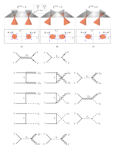

<figure>
    
    <figcaption align="center"> Some Weyl cones and Feynman diagrams. </figcaption>
</figure>

## Overview

My current PhD research focuses on the investigation of novel spin/charge transport phenomena in topological materials. Specifically, topological semimetals, such as Weyl and Dirac semimetals, are three-dimensional topological phases with gapless excitations. Due to the interplay of their unique topology and symmetries, they exhibit topologically protected boundary excitations---[Fermi arc states](https://arxiv.org/abs/1702.07310) for Weyl semimetals and [higher-order Fermi arc (HOFA) states](https://arxiv.org/abs/1908.00016) for Dirac semimetals---as well as interesting phenomena like the chiral anomaly, which manifests in novel transport responses such as the [negative magnetoresistance](https://arxiv.org/abs/1206.1627) and the [nonlinear Hall effect](https://arxiv.org/abs/2007.10887) proposed in one of our works. More details can be found in this [review article](https://arxiv.org/abs/1705.01111).

I have also worked on Dirac and Majorana dark matter models that establish a possible connection between baryon number violation and dark matter phenomenology. See publications below for more details.

------

## Publications

1. **R.-H. Li**, P. Shen, and S. S.-L. Zhang, [*Tunable spin-charge conversion in topological Dirac semimetals*](https://aip.scitation.org/doi/10.1063/5.0077431), APL Mater. **10**, 041108 (2022).
2. **R.-H. Li**, O. G. Heinonen, A. A. Burkov, and S. S.-L. Zhang, [*Nonlinear Hall effect in Weyl semimetals induced by chiral anomaly*](https://journals.aps.org/prb/abstract/10.1103/PhysRevB.103.045105), Phys. Rev. B **103**, 045105 (2021).
3. P. Fileviez Perez, E. Golias, **R.-H. Li**, C. Murgui, and A. D. Plascencia, [*Anomaly-free dark matter models*](https://journals.aps.org/prd/abstract/10.1103/PhysRevD.100.015017), Phys. Rev. D **100**, 015017 (2019).
4. P. Fileviez Perez, E. Golias, **R.-H. Li**, and C. Murgui, [*Leptophobic dark matter and the baryon number violation scale*](https://journals.aps.org/prd/abstract/10.1103/PhysRevD.99.035009), Phys. Rev. D **99**, 035009 (2019).

------

## Talks
- [Introduction to (Qiskit) Quantum Machine Learning](/files/QML_slides.pdf) (2022)  
  Talk given in [Qiskit Fall Fest 2022](https://qiskit.org/events/fall-fest/) at CWRU, which I also co-organized.
- [Introduction to QAOA](/files/QOSF_Meeting.pdf) (2022)  
  Talk given at the [QOSF Mentorship Program](https://qosf.org/qc_mentorship/) meeting.
- [Majorana Zero Modes in a Kitaev Chain](/files/CMP_JC_Spring_22.pdf) (2022)  
  Talk given at the CMP Journal Club at CWRU in Spring 2022. 
- [Tunable spin-charge conversion in topological Dirac semimetals](/files/Ruihao_Li_APS_22.pdf) (2022) 
  - 2022.3: APS March Meeting 2022, Chicago, IL, USA.
  - 2021.8: The 2021 Around-the-Clock Around-the-Globe magnetics Conference (AtC-AtG), Virtual.
- [Chiral-anomaly-induced nonlinear Hall effect in Weyl semimetals](/files/Ruihao_Li_MMM_20.pdf) (2020)
  - 2020.11: The 65th Annual Conference on Magnetism and Magnetic Materials (MMM 2020), Virtual.
  - 2020.8: The 2020 Around-the-Clock Around-the-Globe magnetics Conference (AtC-AtG), Virtual. (**Best Presentation Awards**)
- [Fantastic dark matter and where to find them: Indirect Detection](/files/CERCA_Spring_19.pdf) (2019)  
  Talk given at the [CERCA](https://cerca.case.edu/) Weekly Seminar in Spring 2019.
- [Baryon number violation and leptophobic dark matter](/files/CERCA_Fall_18.pdf) (2018)  
  Talk given at the [CERCA](https://cerca.case.edu/) Weekly Seminar in Fall 2018.
- [Quantum corrections in left-right symmetric seesaw mechanisms](/files/Honours_talk_16.pdf) (2016)  
  Talk given as my Honours year final presentation in Oct, 2016.

------

## Miscellaneous Notes
- [Quantum Field Theory in Curved Spacetime](/files/QFT_in_curved_spacetime.pdf) (2018). A short introduction to quantum field theory in curved spacetime.
- [Introduction to Quantum Field Theory](/files/QFT_course_16.pdf) (2016). Lecture notes compiled based on the Honours course on Quantum Field Theory.
- [Particle Cosmology and Baryonic Astrophysics](/files/PCBAP_course_16.pdf) (2016). Lecture notes compiled based on the Honours course on Particle Cosmology and Baryonic Astrophysics.